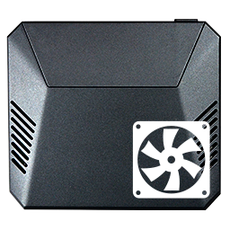

<div align="center">
  <h1>Argon Fan HAT / Argon ONE Case Fan Controller for Ubuntu / Alpine</h1>
  
  
  <br />
  <p align="center">Made with 💝 for  & </p>
</div>

## Introduction

**This is a fork of [tssva/argon1-ubuntu](https://github.com/tssva/argon1-ubuntu) (itself a fork of [wimpysworld/argon1-ubuntu](https://github.com/wimpysworld/argon1-ubuntu)).**

`argon1` is a refactored version of the Argon FanHAT / Argon ONE Case Fan
controller for Ubuntu and is derived from the original script published by
[Argon Forty](https://www.argon40.com/) here:

* [https://download.argon40.com/argon1.sh](https://download.argon40.com/argon1.sh)

The fork contains:

* Split file structure
* Fixes for latest Ubuntu LTS
* Added support for Alpine Linux

## Installation

This script will only work on a [Raspberry Pi](https://www.raspberrypi.com/) running [Ubuntu](https://ubuntu.com/download/raspberry-pi) or [Alpine Linux](https://alpinelinux.org/).

* Clone the project
  * `git clone https://github.com/SoloPatryk/argon1-drivers.git`
* Install the fan controller
  * `cd argon1-drivers`
  * `sudo ./argon1 install`

### Usage

```
Usage: ./argon1 [MODE]

Modes:
  c, config         Display current fan configuration
  i, install        Install the Argon ONE Case Fan / Argon FanHAT driver
  u, rm, uninstall  Uninstall the Argon ONE Case Fan / Argon FanHAT driver
  h, help           Display this usage information
```

To modify your fan curve edit `/etc/argononed.conf` and then execute

* On Ubuntu `sudo systemctl restart argononed.service`
* On Alpine `doas rc-service argononed restart`

to make the changes active.

### Argon ONE Pi 4 Power Button Functions


| Power State |       Action       |          Function           |
| :---------: | :----------------: | :-------------------------: |
|     OFF     |    Short Press     |           Turn ON           |
|     ON      | Long Press (>=3s)  | Soft Shutdown and Power Cut |
|     ON      | Short Press (<=3s) |           Nothing           |
|     ON      |     Double Tap     |           Reboot            |
|     ON      | Long Press (>=5s)  |       Forced Shutdown       |

### Argon Fan HAT Power Button Functions


| Power State |       Action       |          Function           |
| :---------: | :----------------: | :-------------------------: |
|     OFF     |    Short Press     |           Nothing           |
|     ON      | Long Press (>=3s)  | Soft Shutdown and Power Cut |
|     ON      | Short Press (<=3s) |           Nothing           |
|     ON      |     Double Tap     |           Reboot            |
|     ON      | Long Press (>=5s)  |       Forced Shutdown       |

## Credits

* Thanks to [Tim Sedlmeyer](https://github.com/tssva/) for their [updated fork of argon1-ubuntu project](https://github.com/tssva/argon1-ubuntu).
* Thanks to [Wimpy's World](https://github.com/wimpysworld/) for their [original argon1-ubuntu project](https://github.com/wimpysworld/argon1-ubuntu).
* Thanks to [kounch](https://github.com/kounch/) for their [Arch Linux PKGBUILD for Argon One](https://github.com/kounch/argonone).
* Thanks to [Cédric Meuter](https://github.com/meuter) for their [argon1.sh adapted for Ubuntu 20.04](https://github.com/meuter/argon-one-case-ubuntu-20.04).
* Thanks to [Argon Forty](https://www.argon40.com/) for their [official argon1.sh case drivers](https://download.argon40.com/argon1.sh)

## TODO

- [ ] Confirm Argon Fan HAT works on Pi 2, 3 and 4.
- [ ] Clean up parsing of the config file.
- [ ] Add universal support for linux distros on raspberrypi.
- [ ] Update to libgpiod gpio lib, which is still being maintained.

## DONE

- [X] Read `/sys/class/thermal/thermal_zone0/temp` in a Pythonic way.
- [X] Replace use of `os.system`.
- [X] Add Alpine Linux support.
